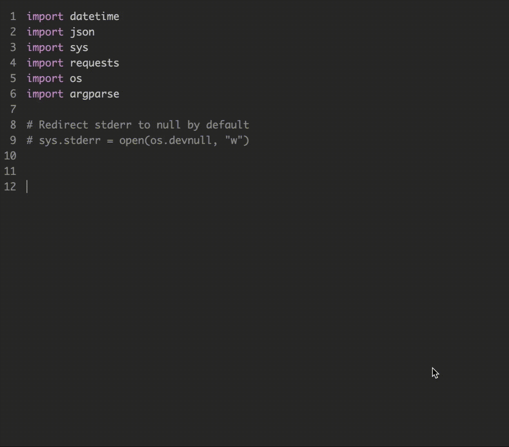

<h1 align="center"><p>Galois Autocompleter</p></h1>

<p>
  
  <a href="https://twitter.com/iedmrc">
    
  </a>
</p>

> An autocompleter for code editors based on [OpenAI GPT-2](https://github.com/openai/gpt-2).

### 🏠 [Homepage](https://usegalois.com)

**Galois** is an auto code completer for code editors (or any text editor) based on [OpenAI GPT-2](https://github.com/openai/gpt-2). It is trained (finetuned) on a curated list of approximately 45K Python (~470MB) files gathered from the Github. Currently, it just works properly on Python but not bad at other languages (thanks to GPT-2's power). 

This repository now contains the very first release of the **Galois Project**. With this project, I aim to create a **Deep Learning Based Autocompleter** such that anyone can run it on their own computer easily. Thus, coding will be more easier and fun!


## Installation

### With Docker
Either clone the repository and build the image from docker file or directly run the following command:

```sh
docker run --rm -dit -p 3030:3030 iedmrc/galois-autocompleter:latest-gpu
```
P.S: CPU image is not available on the *Docker Hub* at the moment so if you want to run it on CPU rather than GPU, clone the repository and build the image as follows:

```sh
docker build --build-arg TENSORFLOW_VERSION=1.14.0-py3 -t iedmrc/galois-autocompleter:latest .
```

### Without Docker

Clone the repository:
```sh
git clone https://github.com/iedmrc/galois-autocompleter
```

Download the latest model from releases and uncompress it into the directory:
```sh
curl -SL https://github.com/iedmrc/galois-autocompleter/releases/latest/download/model.tar.xz | tar -xJC ./galois-autocompleter

```
Install dependencies:
```sh
pip3 install -r requirements.txt
```
P.S.: Be sure that you have tensorflow version >= 1.13

Run the autocompleter:
```sh
python3 main.py
```

## Usage
Currently, there are no extensions for code editors. You can use it through HTTP. When you run the `main.py`, it will serve an HTTP (flask) server. Then you can easily make a POST request to the http://localhost:3030/ with the some `JSON` body like the following:

```sh
{text: "your python code goes here"}
```

An example curl command:

```sh
curl -X POST \
  http://localhost:3030/autocomplete \
  -H 'Content-Type: application/json' \
  -d '{"text":"import os\nimport sys\n# Count lines of codes in the given directory, separated by file extension.\ndef main(directory):\n  line_count = {}\n  for filename in os.listdir(directory):\n    _, ext = os.path.splitext(filename)\n    if ext not"}'
  ```

  > Check out the [gist here](https://gist.github.com/iedmrc/1e41197a6a2f7a9a654a0df9bd932290) for a `docker-compose` file.

## Finetuning The Model
Even you can finetune (re-train over) the model with/for your code files. Just follow the `Max Woolf's` [gpt-2-simple](https://github.com/minimaxir/gpt-2-simple) or `Neil Shepperd's` [gpt-2](https://github.com/nshepperd/gpt-2) repositories with **`345M`** version. But don't forget to replace checkpoint (model) with the one in this repository.

You can train it on the Google Colaboratory for free. But if you need a production-grade (i.e. more accurate) one then you may need to train it for more longer time. In my case, it took ~48 hours on a P100 GPU.

## Planned Works

- Train the model to predict in most common programming languages.
- Create extensions for most common code editors to use galois as an autocompleter.
- Create a new, more lightweight but powerful model such that anyone can run it in their computer easily.

## Contribution
Contributions are welcome. Feel free to create an issue or a pull request.

## Author

👤 **Ibrahim Ethem DEMIRCI**

Twitter: [@iedmrc](https://twitter.com/iedmrc) | Github: [@iedmrc](https://github.com/iedmrc) | Patreon: [@iedmrc](https://patreon.com/iedmrc)


Ibrahim's open-source projects are supported by his Patreon. If you found this project helpful, any monetary contributions to the Patreon are appreciated and will be put to good creative use.

## License
It is licensed under MIT License as found in the LICENSE file.

## Disclaimer
This repo has no affiliation or relationship with OpenAI.